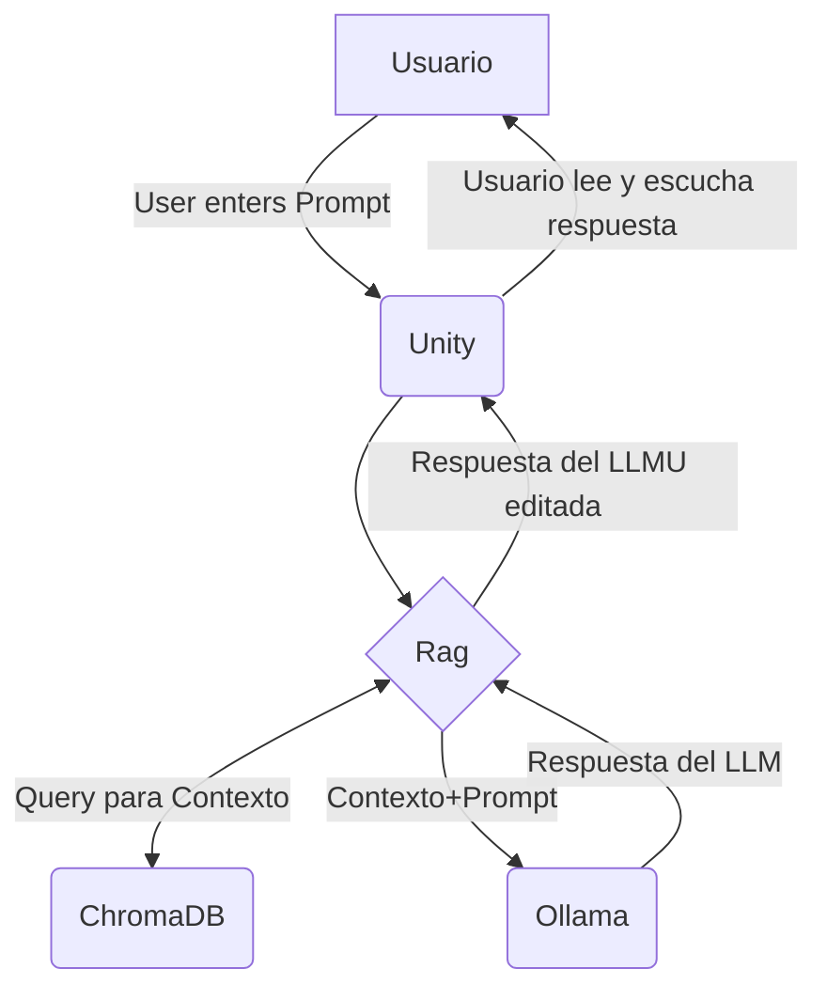

# Alina un personaje Real
El objetivo de este proyecto es facilitar la interacción con un personaje ficticio a partir de un modelo LLM tipo RAG, utilizando un corpus de texto que describa al mismo junto a preprompting.
Este luego se comunicate mediante un servidor TCP con una aplicación de escritorio de Unity en el mismo equipo. 

# Flow

# Modo de despliegue
## Requisitos 
- Python3
- Docker Desktop
- Clonar este repo
## Configuración
Dentro de la carpeta despliegues, en "config.py" has de añadir un nuevo diccionario al diccionario de entornos y definir donde quieres que se encuentren estas variables.
## CI
Ya que de momento la imagen se encuentra en un repositorio privado de docker, has de ir a ./app y ejecutar docker build -t mcortes027/alina_rag:latest .
## Despliegue
Una vez has hecho la imagen, puedes desplegar posicionandote dentro de la carpeta despliegues y ejecutando python3 levantar.py (tuentorno)
## Sobre el contexto
Si deseas ejecutar el RAG con el contexto cargado, has de ejecutar levantar.py, y a continuación crear la BBDD Alina_BD_Vector dentro de chromadb, esto se puede hacer de la siguiente manera: 
WIP!!

